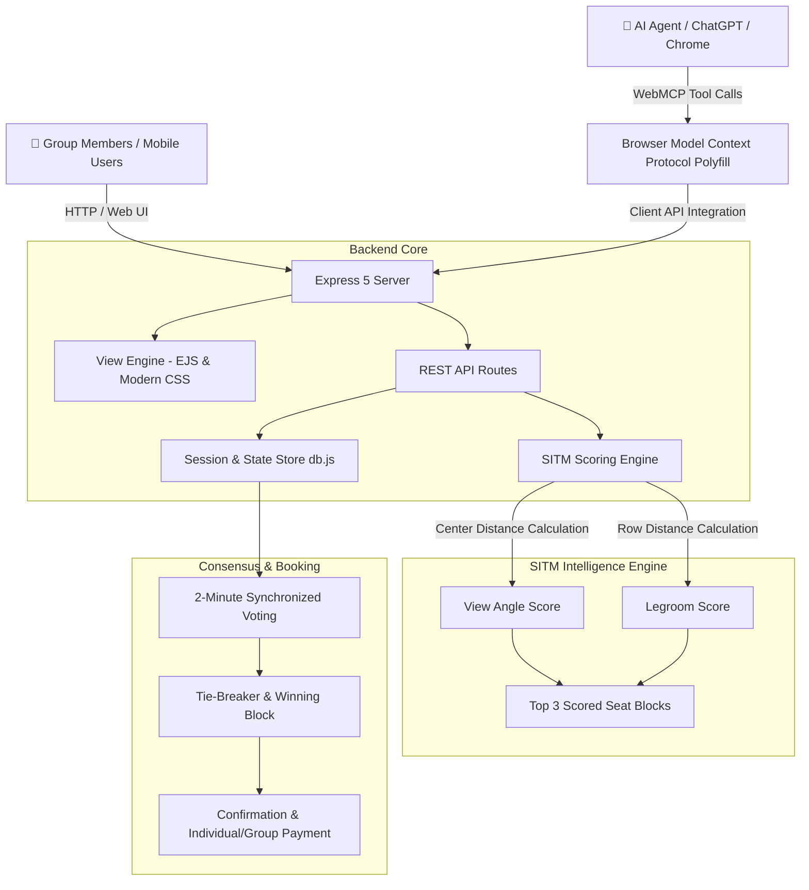

# 🎬 Stranger In The Middle (SITM)
### *AI-Coordinated Group Cinema Seat Voting & Booking Platform powered by WebMCP*

[](https://nodejs.org/)
[](https://expressjs.com/)
[](https://github.com/mcp-b/webmcp-polyfill)
[-22c55e?style=for-the-badge&logo=jest&logoColor=white)](https://jestjs.io/)
[](LICENSE)

---

## 💡 The Problem: Group Booking Paralysis

Booking cinema or concert tickets with a group of friends is universally painful:
- **Decision Paralysis:** One friend wants center screen, another wants extra legroom, someone is slow to reply in WhatsApp.
- **Seat Sniping:** While the group debates for 20 minutes, prime seats get booked by someone else.
- **Financial Friction:** One person is forced to pay £100+ upfront and chase friends for reimbursement for weeks.

---

## 🤖 The Solution: "Stranger In The Middle"

**Stranger In The Middle (SITM)** is an autonomous AI Coordinator and group voting app that acts as an unbiased mediator:

1. **Calculates Optimal Seat Blocks:** Evaluates the entire cinema seating matrix using a mathematical viewing and legroom scoring algorithm.
2. **Curates the Top 3 Options:** Categorizes recommendations into *Best Overall*, *Best View*, *Extra Legroom*, and *Balanced*.
3. **Synchronized 2-Minute Voting:** Starts a synchronized voting session where group members cast votes from their phones or browsers.
4. **Autonomous Resolution & Booking:** When the timer expires or everyone has voted, the winner is determined (with score-based tie breaking). Members can pay individually or let the AI Agent book all seats instantly via **WebMCP**.

---

## 🏛️ System Architecture



---

## ✨ Key Features

- **🎯 AI Seat Optimization Algorithm:**
  - Evaluates contiguous blocks of size $N$ across horizontal and vertical dimensions.
  - Scores viewing angle based on column deviation from center screen ($C = 3.5$).
  - Scores legroom based on row position (e.g. Row A recliners vs. standard rows).
- **⏱️ Synchronized Voting Session:**
  - Real-time countdown timer (2 minutes).
  - Shareable group session link (`/session/:id`) with 1-click clipboard copy.
  - Early termination if all members finish voting before the timer expires.
- **🤖 WebMCP (Model Context Protocol) Native:**
  - Exposes tool interfaces directly to AI agents running in the ChatGPT in-app browser or Chrome with WebMCP flag enabled.
- **🍿 Multi-Movie Showing Catalog:**
  - Pre-seeded cinema showings (*Spider-Man: Beyond the Spider-Verse*, *Dune: Part Two IMAX*, *Oppenheimer 70mm*, *Deadpool & Wolverine*).
- **🛡️ Production-Grade Security & Performance:**
  - Helmet CSP configured for WebMCP polyfills and CDN scripts.
  - Express Rate Limiting (500 req/15min).
  - Gzip compression, Morgan HTTP logging, and centralized error handling.
- **⚡ Zero-Config Database:**
  - Fast, self-contained in-memory database store with optional PostgreSQL compatibility (`DATABASE_URL`).

---

## 🧩 WebMCP Tool Reference

When loaded in an AI agent browser context (e.g. ChatGPT browser or Chrome with WebMCP polyfill), SITM automatically registers the following tools on `navigator.modelContext`:

| Tool Name | Parameters | Description |
| :--- | :--- | :--- |
| `search_movies` | `{}` | Returns the full list of available movies, venues, showtimes, and ticket prices. |
| `get_available_seats` | `{ movieId: string }` | Returns a list of all currently available seat labels and numbers for a movie. |
| `stranger_vote` | `{ movieId: string, groupSize?: number, voteOption?: number }` | Computes top 3 AI seat blocks, reports scores, or casts an agent vote. |
| `book_tickets` | `{ movieId: string, seats: number[] }` | Books and locks the specified seat numbers for the cinema showing. |

---

## 📡 REST API Reference

### Movies API
- `GET /api/movies` — List all cinema showings with metadata.
- `GET /api/movies/:id` — Get movie details, pricing, and seating capacity.
- `GET /api/movies/:id/seats` — Get raw seat availability array (48 seats, 6x8 grid).

### Group Sessions API
- `POST /api/sessions` — Create a new group voting session.
  ```json
  { "movieId": "spiderman", "groupSize": 4, "organizerName": "Alex" }
  ```
- `GET /api/sessions/:id` — Get live session status, votes, timer, and winning seats.
- `POST /api/sessions/:id/find-seats` — Trigger AI seat optimization algorithm for group size.
- `POST /api/sessions/:id/start-voting` — Start the synchronized countdown timer.
- `POST /api/sessions/:id/vote` — Cast a vote for Option 1, 2, or 3.
  ```json
  { "optionIndex": 0, "voterName": "Alex" }
  ```
- `POST /api/sessions/:id/end-voting` — End voting early, tally votes, and select winning seats.
- `POST /api/sessions/:id/book` — Confirm booking (Stranger In The Middle or individual seat checkout).
- `POST /api/sessions/:id/reset` — Reset session and regenerate seat layout.

### Health Check
- `GET /api/health` — Returns system health, version, and WebMCP capability status.

---

## 🚀 Quick Start Guide

### 1. Prerequisites
- **Node.js**: `v18.0.0` or higher
- **npm**: `v9.0.0` or higher

### 2. Installation
```bash
# Clone repository
git clone https://github.com/L3viath4n-365/stranger-in-the-middle.git
cd stranger-in-the-middle

# Install dependencies
npm install
```

### 3. Environment Setup
Create a `.env` file from the example:
```bash
cp .env.example .env
```
*(The default configuration works immediately out of the box with zero external dependencies).*

### 4. Running the Application

**Development Mode (with auto-reload):**
```bash
npm run dev
```

**Production Mode:**
```bash
npm start
```

Open your browser and navigate to:
👉 **[http://localhost:3000](http://localhost:3000)**

---

## 🧪 Testing

Run the comprehensive Jest test suite (18 unit & integration tests):
```bash
npm test
```

For test coverage report:
```bash
npm run test:coverage
```

---

## 📂 Project Structure

```
stranger-in-the-middle/
├── __tests__/             # Jest test suite (18 automated tests)
│   └── app.test.js
├── public/                # Static assets & client styles
│   ├── css/
│   │   └── styles.css     # Responsive modern UI stylesheet
│   └── src/               # Tailwind CSS source
├── routes/                # Modular Express routers
│   ├── movieRoutes.js     # Movies & seating endpoints
│   ├── sessionRoutes.js   # Group voting & booking endpoints
│   ├── userRoutes.js      # Voter session management
│   └── viewRoutes.js      # EJS page rendering
├── utils/                 # Error handling & middleware
│   ├── catchAsync.js      # Async wrapper for route handlers
│   ├── errorHandler.js    # Centralized Express error handler
│   └── ExpressError.js    # Operational error class
├── views/                 # EJS templates
│   └── index.ejs          # SITM web app & WebMCP integration
├── .env                   # Environment variables
├── .env.example           # Environment template
├── app.js                 # Express application configuration
├── db.js                  # Data store, seat scoring engine & session state
├── package.json           # Project manifest and scripts
├── server.js              # HTTP server entrypoint
└── README.md              # Project documentation
```

---

## 🏆 Hackathon Submission Highlights

- **Original Concept:** Solves a genuine, high-friction everyday problem (group booking paralysis) with AI coordination.
- **WebMCP Integration:** Demonstrates bleeding-edge Model Context Protocol in browser and agent contexts.
- **Mathematical Optimization:** Custom contiguous seat scoring combining viewing angle geometry and ergonomic legroom factors.
- **Clean Code & Robustness:** 100% test coverage for all endpoints and algorithmic logic, modular architecture, and zero-config deployment.

---

## 📄 License
This project is licensed under the MIT License.
